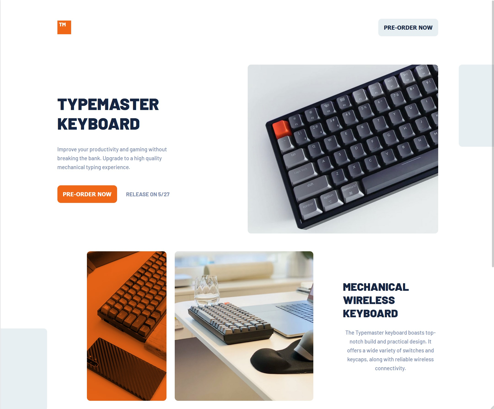
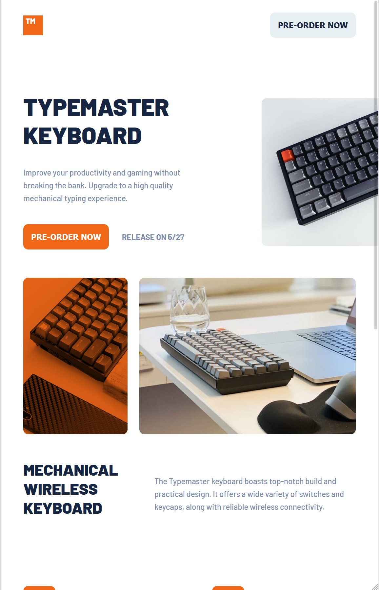
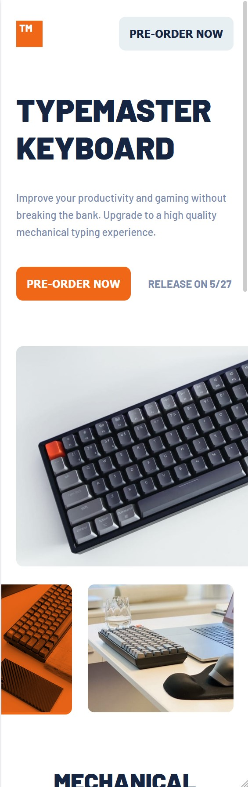

# Frontend Mentor - Typemaster pre-launch landing page solution

This is a solution to the [Typemaster pre-launch landing page challenge on Frontend Mentor](). Frontend Mentor challenges help you improve your coding skills by building realistic projects.

## Table of contents

- [Frontend Mentor - Typemaster pre-launch landing page solution](#frontend-mentor---typemaster-pre-launch-landing-page-solution)
  - [Table of contents](#table-of-contents)
  - [Overview](#overview)
    - [The challenge](#the-challenge)
    - [Screenshot](#screenshot)
    - [Links](#links)
  - [My process](#my-process)
    - [Built with](#built-with)
    - [What I learned](#what-i-learned)
    - [Continued development](#continued-development)
  - [Author](#author)

## Overview

### The challenge

Users should be able to:

- View the optimal layout in different screen sizes.
- Hover over buttons

### Screenshot

### Links

- Solution URL: [https://github.com/sannasinne/typemaster-pre-launch-landing-page](https://github.com/sannasinne/typemaster-pre-launch-landing-page)
- Live Site URL: [https://sannasinne.github.io/typemaster-pre-launch-landing-page/](https://sannasinne.github.io/typemaster-pre-launch-landing-page/)

## My process

### Built with

- Semantic HTML5 markup
- CSS custom properties
- Flexbox
- CSS Grid
- Mobile-first workflow

### What I learned

During this project I learned to work with Flexbox and Grid at the same time. It was a bit hard to understand the ways Grid work but after a lot of work I figured it out

### Continued development

Surely going to need more practice with Grid.

## Author

- Frontend Mentor - [@sannasinne](https://www.frontendmentor.io/profile/sannasinne)
